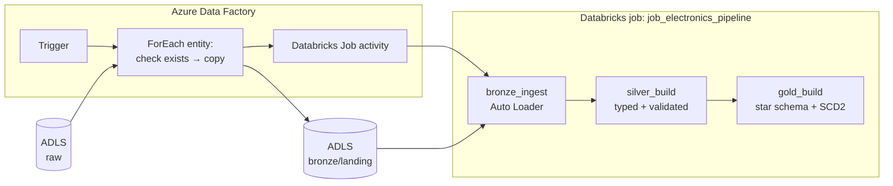
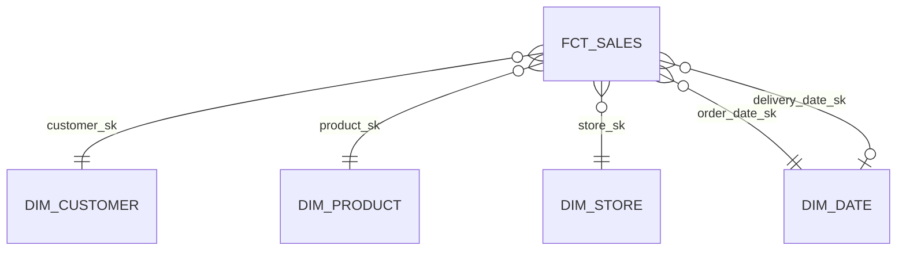

# Azure Electronics Lakehouse

An end-to-end lakehouse on Azure that ingests the Global Electronics Retailer dataset (sales, customers, products, stores, exchange rates), moves it through bronze, silver and gold layers, and produces a star schema with a slowly changing customer dimension.

Azure Data Factory lands the files and triggers a three-task Databricks job. Auto Loader ingests incrementally into bronze, silver types and validates the data, and gold builds four dimensions and a fact table — with data-quality assertions that fail the job rather than let bad data through.

No secrets are stored anywhere in the code or configuration. Every connection between services uses a managed identity.

## Architecture



**Orchestration is split deliberately.** ADF orchestrates *between* systems: it moves files and tells Databricks to start. Databricks orchestrates *within* itself: task dependencies between bronze, silver and gold live in the job definition. Adding a new layer changes the Databricks job, not the ADF pipeline.

A `run_date` parameter flows from the ADF pipeline → Job activity → job parameters → notebook widgets → PySpark, and is stamped onto every row as lineage.

## Stack

Azure Data Factory · ADLS Gen2 · Azure Databricks (serverless) · Unity Catalog · Delta Lake · Auto Loader · PySpark · Databricks Connect · GitHub

## Data

Source: the Global Electronics Retailer sample dataset, 2016-01-01 to 2021-02-27.

| Entity | Rows | Grain |
|---|---|---|
| sales | 62,884 | one row per order line (`order_number` + `line_item`) |
| customers | 15,266 | one row per customer |
| products | 2,517 | one row per product |
| stores | 67 | one row per store (store 0 is the online store) |
| exchange_rates | 11,215 | one row per day per currency |

Issues found while profiling, and how each is handled:

- **`Customers.csv` is Latin-1, not UTF-8.** Read as UTF-8, German and Italian city names silently become `M�nchen`. Row counts and schema were correct; the data was wrong. Fixed with a per-entity read option, and guarded by an assertion that fails on the Unicode replacement character.
- **Prices are strings** such as `"$6.62 "`. Stripped explicitly and cast to `decimal(10,2)` — never float.
- **Dates are `M/d/yyyy`.** Parsed with an explicit format and a count check that fails if any value was lost in the cast.
- **`delivery_date` is null for ~79% of rows.** Not a defect: only online orders have a delivery date.
- **Store 0 has no square footage.** Also not a defect: it's the online store.

## Layers

### Bronze — as delivered

Auto Loader reads each entity's landing folder with `trigger(availableNow=True)`: process everything new, then stop. Checkpoints live in `bronze/_checkpoints/<entity>/`, so re-running with no new files appends nothing.

Bronze is **lossless**. The only changes are renaming headers to `snake_case` (Delta rejects spaces) and adding lineage columns: `_file_path`, `_ingested_at`, `_run_date`. No values are altered — bronze is the only route back to the source if a later layer turns out to be wrong.

### Silver — typed and validated

Rebuilt from the bronze tables each run. Casts are driven by a per-entity type config; operations that aren't simple casts (money cleaning) are plain Python. Every lossy cast is checked by counting non-null values before and after.

Lineage columns travel unchanged. They describe where a row *came from*, so rewriting them at each layer would destroy the only thing that makes them useful.

### Gold — star schema



| Table | SCD | Grain | Rows |
|---|---|---|---|
| `dim_customer` | Type 2 | one row per customer version | 15,267 |
| `dim_product` | Type 1 | one row per product | 2,517 |
| `dim_store` | Type 1 | one row per store | 67 |
| `dim_date` | — | one row per day, 2015–2026 | 4,383 |
| `fct_sales` | — | one row per order line | 62,884 |

`dim_customer` has one more row than there are customers: one customer changed city during testing, so they have a closed historical version and a current one. Their earlier orders still report under the old city.

## Design decisions

**No secrets, anywhere.** An Access Connector gives Databricks a managed identity with `Storage Blob Data Contributor` on the storage account; Unity Catalog wraps it as a storage credential and external locations. ADF uses its own managed identity for both storage and Databricks. Unity Catalog vends short-lived, path-scoped SAS tokens to compute, so no process ever holds a long-lived credential.

**Idempotent ingestion.** Auto Loader tracks processed file paths in its checkpoint. The whole pipeline can be re-run safely — which is also what makes the ADF retry policy safe. Reprocessing from scratch is a deliberate operation that resets the checkpoint *and* the table together; either alone leaves them inconsistent.

**Star, not snowflake.** Country, continent, category and subcategory are plain columns on their dimensions rather than separate tables. Normalisation prevents update anomalies, but a dimension is written only by the pipeline, so there are none to prevent — while every extra join is a cost to every analyst query.

**SCD2 on customer location only.** City, state, zip, country and continent are Type 2: a change creates a new version. Name, gender and birthday are treated as corrections rather than history. Changes are detected with a hash over the Type 2 columns, and the MERGE stages each changed customer twice — once to close the old row, once (with a `NULL` merge key that can never match) to insert the new one.

**Stable surrogate keys.** Surrogate keys are deterministic hashes (`xxhash64`) rather than row numbers, so rebuilding a dimension never reassigns keys under an existing fact table. The `dim_customer` key includes the versioned attributes, so each version gets its own key.

**Point-in-time fact loading.** `fct_sales` joins to `dim_customer` where the order date falls between `valid_from` and `valid_to`, so each sale links to the customer version that was true when it happened.

**Measures stored in the fact.** `revenue_usd`, `cost_usd` and `margin_usd` are computed at load time rather than joined at query time, so a later price change can't silently rewrite historical revenue.

**No wall-clock logic in transformations.** An `age` column derived from `current_date()` was removed from silver: the same input would produce different output depending on when the job ran. Age belongs where "as of when" is an explicit question.

## Data quality

Checks run inside the build functions and raise with a count, so a failure says *how bad* rather than just *that* something failed.

| Check | Layer | Catches |
|---|---|---|
| No replacement characters in strings | bronze | wrong file encoding |
| Non-null count unchanged by date casts | silver | unparseable dates |
| `_rescued_data` empty | silver | schema drift at ingestion |
| Surrogate keys unique | gold | hash collisions, duplicate rows |
| Exactly one current version per customer | gold | broken SCD2 merge |
| No null foreign keys in the fact | gold | referential integrity failures |
| Fact row count equals silver sales | gold | join fan-out duplicating facts |

## Known limitations

- **Prices are snapshotted at load time, not sale time.** The source has one current price per product and no price history, so stored revenue is an approximation of what was actually charged.
- **ADF lands files under the same name each run.** Auto Loader tracks file paths, so a re-delivered file with the same name would be ignored. A production version would land files in date-partitioned paths.
- **`dim_customer` is validated after the MERGE, not before.** A failing assertion leaves the bad table in place. Merging into a staging table and swapping would fix this.
- **Exchange rates are ingested but unused.** Sales carry a currency code but no local-currency amount, so there's nothing meaningful to convert.
- **Imports rely on `sys.path` manipulation.** Packaging `src/` as a library, or deploying with Databricks Asset Bundles, would be more robust.
- **Validation is expensive on small data.** Each assertion triggers its own Spark action; combining checks into single aggregate passes would cut runtime considerably.
- **No unit tests or CI/CD yet.**

## Repo structure

```
src/
  bronze.py        Auto Loader ingestion
  clean.py         silver type config and casting helpers
  silver.py        silver build
  gold.py          dimensions, SCD2 merge, fact
  quality.py       data-quality assertions
notebooks/
  jobs/            thin entry points run by the Databricks job
  exploration/     profiling and development notebooks
docs/
  notes/           daily learning notes
  plan/            original week plan and cheatsheet
```

Logic lives in `src/` and never touches `dbutils`, so it can run from an IDE via Databricks Connect. The job notebooks only read widgets and call into `src/`.

## How to run

**Azure resources** (Germany West Central): resource group, ADLS Gen2 storage account with hierarchical namespace and `raw` / `bronze` / `silver` / `gold` containers, Access Connector for Azure Databricks, Azure Databricks workspace (Premium), Azure Data Factory.

**Identity:** grant `Storage Blob Data Contributor` to the Access Connector and to ADF's managed identity. Add ADF's managed identity to Databricks as a service principal using its **application ID** (not its object ID), with workspace access and `Can Manage Run` on the job.

**Databricks:** create the storage credential and one external location per container. Create `job_electronics_pipeline` with three Git-sourced notebook tasks — `bronze_ingest`, `silver_build`, `gold_build` — chained by dependency, with job-level parameters `catalog` and `run_date`.

**Run:** debug the ADF pipeline with a `run_date`, or run the Databricks job directly.

**Local development:**

```bash
databricks auth login --host https://<workspace>.azuredatabricks.net --profile azure
```

```python
from databricks.connect import DatabricksSession
spark = DatabricksSession.builder.serverless().profile("azure").getOrCreate()
```

## Cost

About €21 over a week of development. Almost all of it was **interactive** serverless compute — Databricks Connect sessions from the IDE — rather than the pipeline itself, whose job runs cost cents. Interactive sessions stay warm after the last command, so the practical lesson was to stop sessions explicitly and not just close the IDE.
